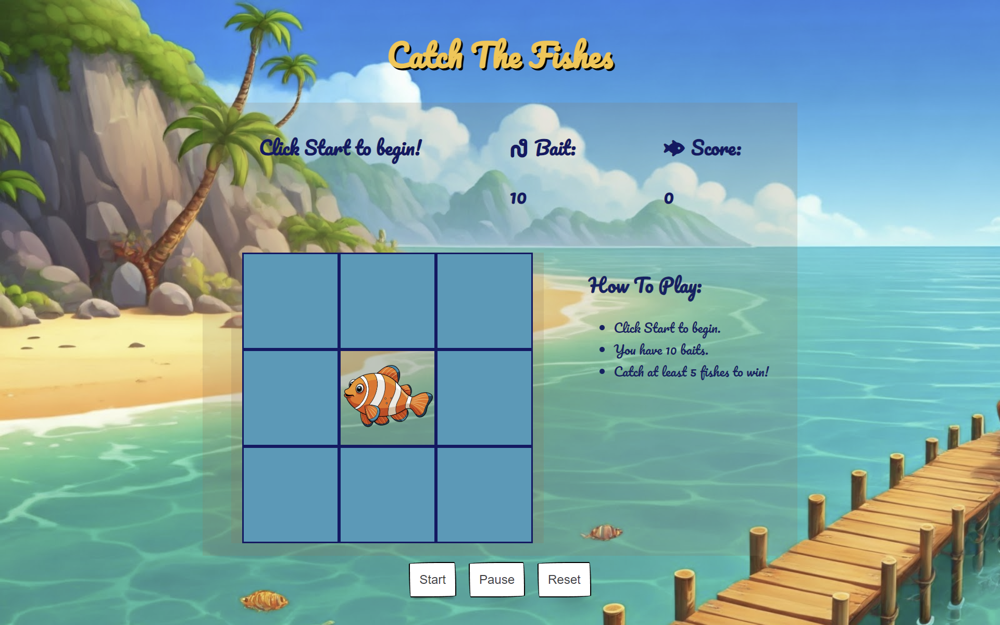

# _Catch The Fishes_



## Background Info

This game is inspired by the _"Whack a Mole"_ game, where the mole appears and the player has to click it to score points. With a twist to the game, _Catch The Fishes_ runs a similar concept where players catch the fishes to hit the minimum points with the given bait to win the game!

## Technologies Used

- `Javascript`
- `HTML`
- `CSS`
- `vscode`

## Getting Started

1. Click the **fork** button at the top right of this page.

2. Open your terminal (example gitbash, powershell), and clone to your desired folder.
   `<your-username>` should be your github username.

```
git clone https://github.com/<your-username>/catch-the-fishes.git
```

3. cd to your new cloned directory:

```
cd catch-the-fishes
```

4. Type the following and it will open up in vscode:

```
code .
```

5. Under `index.html` , right click and 'Open with Live Server' to play!

## Future Enhancements

Further features to this game such as variety of fish species, map size and game difficulty could be implemented in future. You may also fork this to create a game with different characters!

## Planning Materials

Resources:
[CSS Buttons](https://getcssscan.com/css-buttons-examples) | [Google Fonts](https://fonts.google.com/selection/embed) |
[Whack-A-Mole](https://www.codewithfaraz.com/content/391/create-a-whack-a-mole-game-with-html-css-and-javascript-step-by-step-guide) |
[Fish Image & Rod Cursor ](https://www.freepik.com/) |
[Image Generator](https://gemini.google.com/app) |
[Game Inspiration](https://www.calculators.org/games/whack-em-all/) | [Icons](https://fontawesome.com/)
